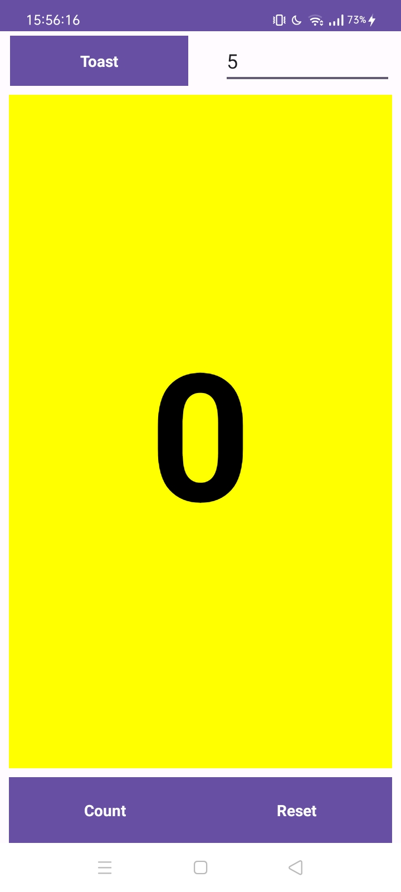
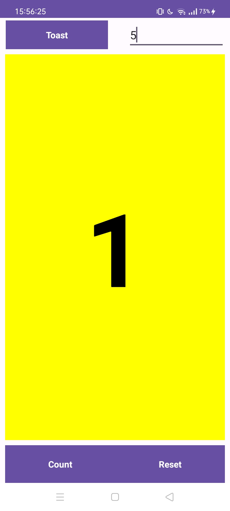
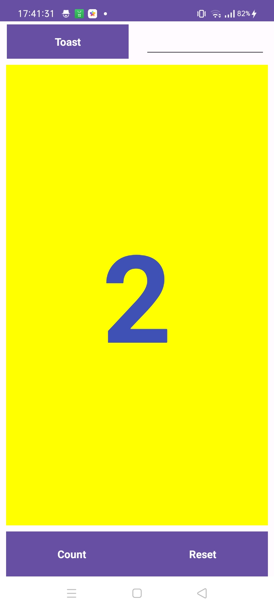
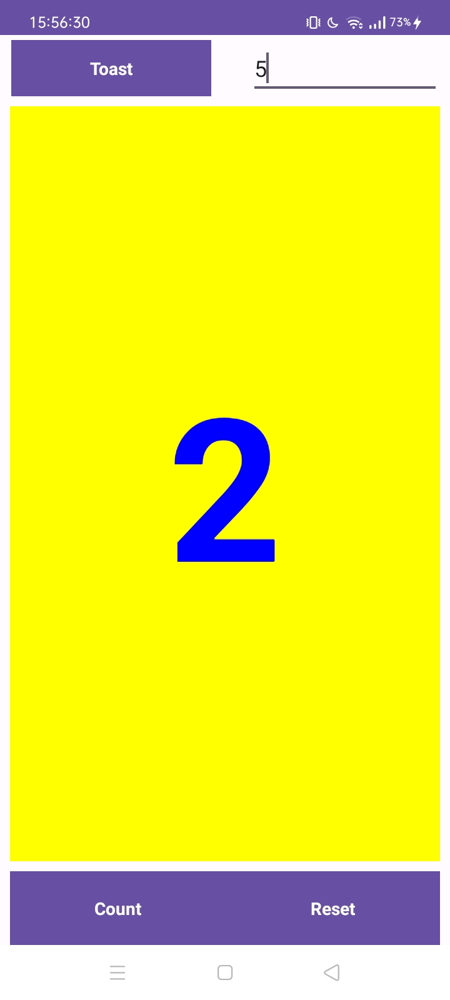
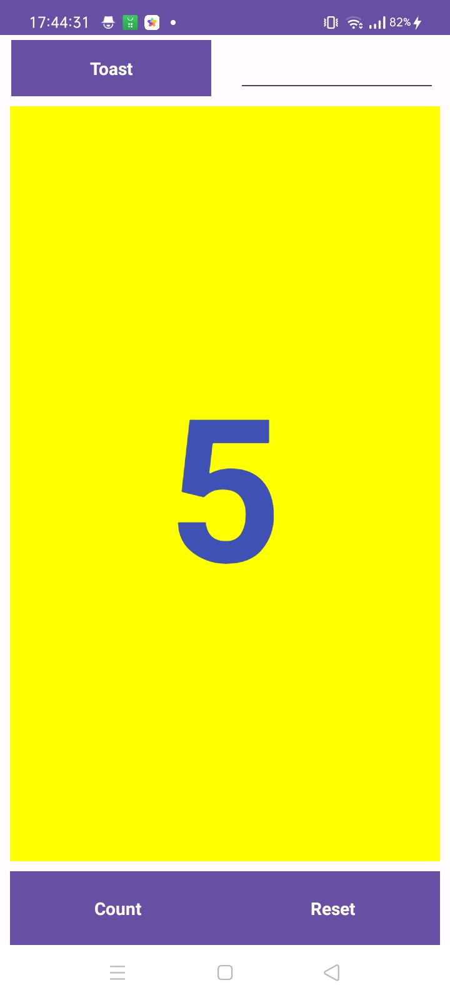
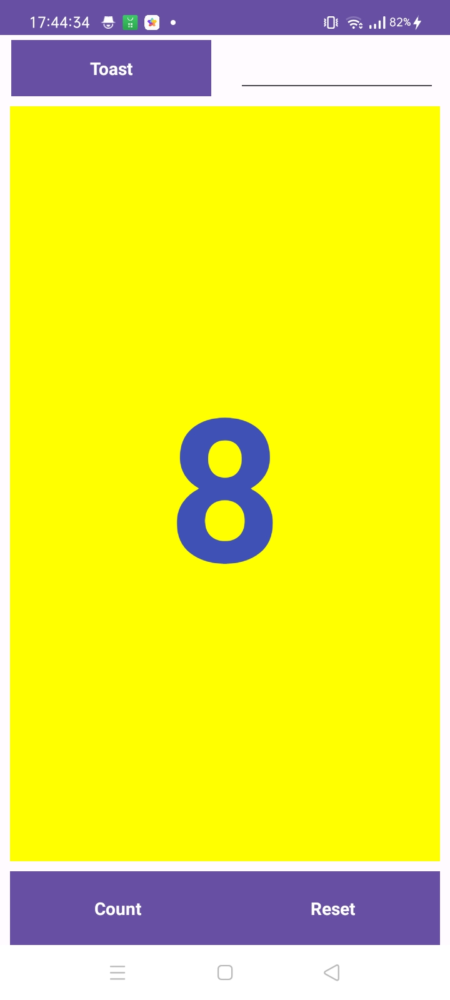
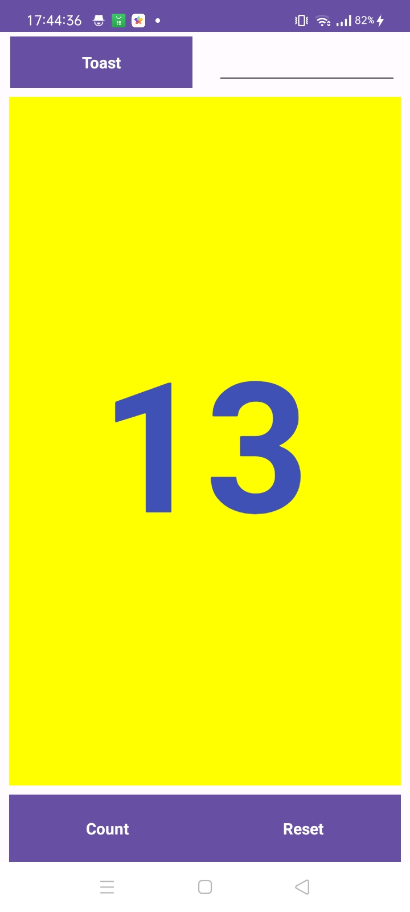
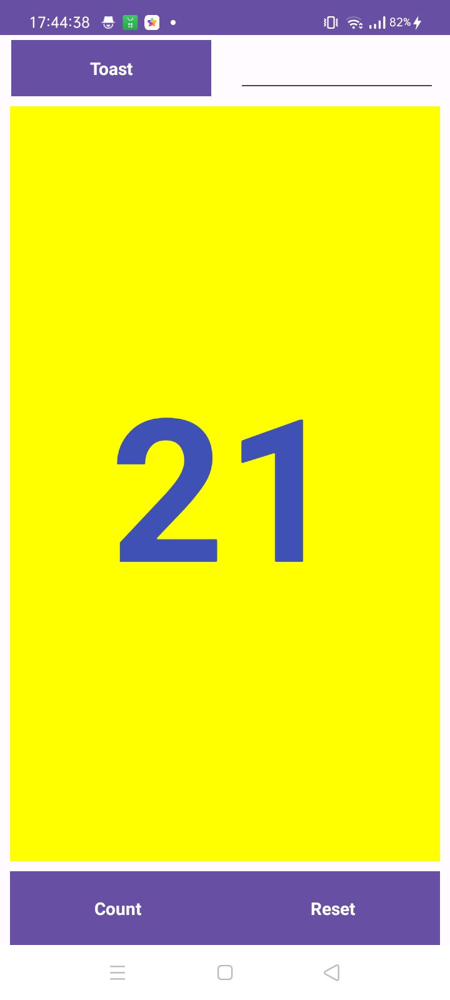
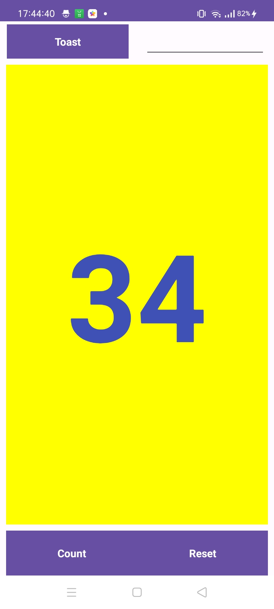

# TUGAS Fibbonanci
### MainActivity.java
```
package com.appsa4;

import androidx.appcompat.app.AppCompatActivity;

import android.os.Bundle;
import android.widget.TextView;
import android.widget.Toast;
import android.view.View;

import org.w3c.dom.Text;

public class MainActivity extends AppCompatActivity {
    private int mCount= 0;
    private TextView mShowCount;
    private int secondCount = 1;

    @Override
    protected void onCreate(Bundle savedInstanceState) {
        super.onCreate(savedInstanceState);
        setContentView(R.layout.activitytoast);
        mShowCount= (TextView) findViewById(R.id.show_count);
    }
    public void showToast(View view) {
        Toast toast = Toast.makeText(this, R.string.toast_message, Toast.LENGTH_SHORT);
        toast.show();
    }

    public void countUp(View view) {
        int next = mCount;
        mCount = secondCount;
        secondCount = next + mCount;
        if (mShowCount != null)
            mShowCount.setText(Integer.toString(next));
    }

    public void reset(View view) {
        mCount = 0;
        secondCount = 1;
        if(mShowCount != null) {
            mShowCount.setText(Integer.toString(mCount));
        }
    }
}
```
### Activity.toast.xml
```
<?xml version="1.0" encoding="utf-8"?>
<androidx.constraintlayout.widget.ConstraintLayout xmlns:android="http://schemas.android.com/apk/res/android"
    xmlns:app="http://schemas.android.com/apk/res-auto"
    xmlns:tools="http://schemas.android.com/tools"
    android:layout_width="match_parent"
    android:layout_height="match_parent"
    tools:context="com.appsa4.MainActivity">

    <EditText
        android:id="@+id/input_number"
        android:layout_width="160dp"
        android:layout_height="45dp"
        android:layout_marginStart="8dp"
        android:layout_marginTop="4dp"
        android:layout_marginEnd="8dp"
        android:ems="10"
        android:inputType="number"
        app:layout_constraintBottom_toTopOf="@+id/show_count"
        app:layout_constraintEnd_toEndOf="parent"
        app:layout_constraintHorizontal_bias="0.833"
        app:layout_constraintStart_toEndOf="@+id/button_toast"
        app:layout_constraintTop_toTopOf="parent"
        app:layout_constraintVertical_bias="0.0" />

    <Button
        android:id="@+id/button_toast"
        android:layout_width="160dp"
        android:layout_height="45dp"
        android:layout_marginStart="8dp"
        android:layout_marginTop="4dp"
        android:layout_marginEnd="8dp"
        android:background="@color/colorPrimary"
        android:onClick="showToast"
        android:text="Toast"
        android:textColor="@android:color/white"
        app:layout_constraintEnd_toEndOf="parent"
        app:layout_constraintHorizontal_bias="0.005"
        app:layout_constraintStart_toStartOf="parent"
        app:layout_constraintTop_toTopOf="parent" />

    <Button
        android:id="@+id/button_count"
        android:layout_width="172dp"
        android:layout_height="59dp"
        android:layout_marginStart="8dp"
        android:layout_marginEnd="8dp"
        android:background="@color/colorPrimary"
        android:onClick="countUp"
        android:text="Count"
        android:textColor="@android:color/white"
        app:layout_constraintBottom_toBottomOf="parent"
        app:layout_constraintEnd_toEndOf="parent"
        app:layout_constraintHorizontal_bias="0.0"
        app:layout_constraintStart_toStartOf="parent" />

    <Button
        android:id="@+id/button_reset"
        android:layout_width="172dp"
        android:layout_height="59dp"
        android:layout_marginStart="8dp"
        android:layout_marginEnd="8dp"
        android:background="@color/colorPrimary"
        android:onClick="reset"
        android:text="Reset"
        android:textColor="@android:color/white"
        app:layout_constraintBottom_toBottomOf="parent"
        app:layout_constraintEnd_toEndOf="parent"
        app:layout_constraintHorizontal_bias="1.0"
        app:layout_constraintStart_toStartOf="parent" />

    <TextView
        android:id="@+id/show_count"
        android:layout_width="0dp"
        android:layout_height="0dp"
        android:layout_marginStart="8dp"
        android:layout_marginTop="8dp"
        android:layout_marginEnd="8dp"
        android:layout_marginBottom="8dp"
        android:background="#FFFF00"
        android:gravity="center_vertical"
        android:text="0"
        android:textAlignment="center"
        android:textColor="@color/colorPrimary"
        android:textSize="160sp"
        android:textStyle="bold"
        app:layout_constraintBottom_toTopOf="@+id/button_count"
        app:layout_constraintEnd_toEndOf="parent"
        app:layout_constraintHorizontal_bias="0.0"
        app:layout_constraintStart_toStartOf="parent"
        app:layout_constraintTop_toBottomOf="@+id/button_toast"
        app:layout_constraintVertical_bias="0.0"
        tools:ignore="RtlCompat" />
</androidx.constraintlayout.widget.ConstraintLayout>
```
# OUTPUT HASIL FIBBONANCI










